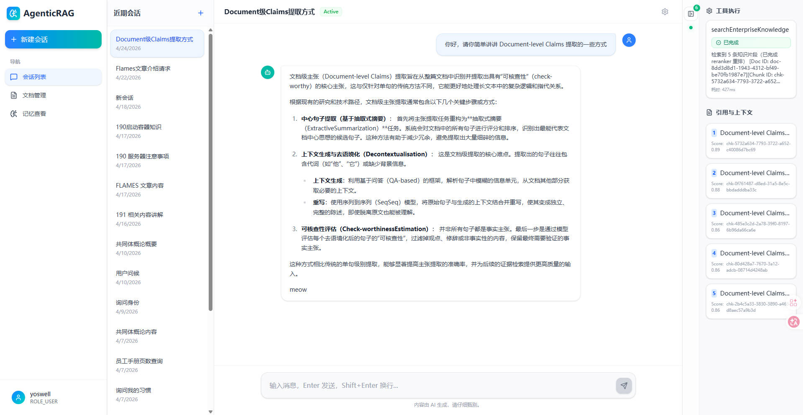
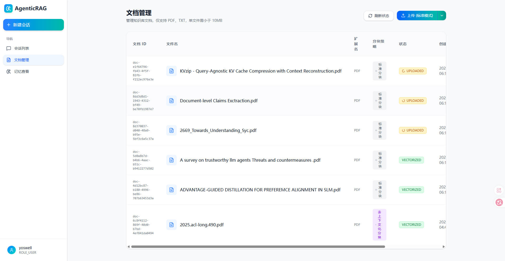

# Agentic RAG - 检索增强生成智能体

<div align="center">

**基于 Java 21 + Spring Boot 4 + LangChain4j 的渐进式架构**

[](https://openjdk.org/projects/jdk/21/)
[](https://spring.io/projects/spring-boot)
[](https://github.com/langchain4j/langchain4j)
[](https://www.elastic.co/elasticsearch/)
[](LICENSE)

</div>


- [项目概述](#项目概述)
- [核心特性](#核心特性)
- [与传统 RAG 的区别](#与传统-rag-的区别)
- [技术栈](#技术栈)
- [架构设计](#架构设计)
- [快速开始](#快速开始)
- [API 文档](#api-文档)
- [许可证](#许可证)

---

## 项目概述

Agentic RAG 是一个企业级的**智能检索增强生成系统**，它不仅提供传统的对话问答，更具备以下核心能力：

- 📑 **创新去上下文化分块策略**：复现前沿研究的 [Decontextualised Chunking](https://aclanthology.org/2024.acl-long.645.pdf) 方案，支持 DECONTEXTUALISED（去语境化改写）与 QA_ENRICHED（问答增强）两种高级策略，显著提升检索召回质量
- 🧠 **单一 Agent 编排（ReAct 模式）**：大模型自主进行推理、工具调用和决策
- 🗜️ **分级上下文压缩**：L1/L2/L3 三层记忆管理，突破 Token 窗口限制
- 💾 **跨会话长期记忆**：持久化用户偏好与知识，实现真正的"认知积累"
- 📄 **高精度异构文档解析**：基于 MinerU 的深度学习版面分析，支持 PDF/Word/TXT 等多格式，采用策略模式和工厂模式实现智能分流
- 🔐 **零信任多租户隔离**：从数据物理层到逻辑层的全面权限控制

本系统的核心理念是**渐进式能力叠加**，每个模块都可以独立演进，同时保持整体架构的一致性。


### 前端项目

本项目配套的前端应用位于 [agenticrag-front](https://github.com/shiyan14712/agenticrag-front)，提供完整的 Web 界面交互体验，包括：

- 💬 流式对话界面（打字机效果、思考动画、工具执行卡片）
- 📊 知识库管理与文档上传
- 📝 会话历史查看与切换
- 🔍 实时检索结果展示与引用溯源


<center> 前端流式对话界面 </center>

---

## 核心特性

### 1. Agent 编排与富媒体交互

- **ReAct 循环可观测性**：实时推送 `thinking` → `tool_start` → `tool_result` → `message` → `citations` 完整链路
- **SSE 流式响应**：基于虚拟线程的异步推流，前端渲染打字机效果、思考动画、工具执行卡片
- **JSON Schema 契约**：确定性流程输出严格的结构化数据，避免正则解析的不稳定性

### 2. 混合检索引擎

- **BM25 + KNN 双路召回**：关键词精确匹配 + 语义模糊理解，并行执行降低延迟
- **RRF 倒数秩融合**：科学合并双路结果，避免单一检索策略的偏差
- **Reranker 重排序**：Cross-Attention 交叉打分，精准筛选 Top-K 相关片段
- **硬阈值过滤**：低于 `final-score-threshold: 0.5` 的候选强制丢弃，保证检索质量

### 3. 分级记忆管理

| 层级 | 范围 | 存储介质 | 压缩策略 |
|------|------|---------|---------|
| **L1 (近程)** | 最近 10 条消息 | Redis | 原文保留 |
| **L2 (中程)** | 第 11-30 条消息 | Redis + MySQL | 轻量级摘要 |
| **L3 (远程)** | 第 31-40 条消息 | Redis + MySQL | 实体与结论提炼 |
| **长期记忆** | 跨会话持久化 | MySQL | 用户偏好自动提取 |

### 4. 异步文档处理管道

```
上传文件 → MinIO 存储 → Kafka 解耦 → MinerU 解析 → 离线 Chunking → Embedding → ES 索引
```

- **策略模式 + 工厂模式**：优雅扩展 TXT、DOCX 等新格式，实现智能分流
- **实体注册表构建**：通过 NER 提取关键实体（PERSON、ORGANIZATION、LOCATION 等），持久化到 MySQL 供后续改写使用
- **智能 Chunk 改写**：支持去上下文化改写和 QA 增强两种策略，基于实体注册表提升检索精度
- **事务型 Outbox**：保证数据库提交与消息投递的最终一致性
- **指数退避重试 + 死信队列**：失败任务自动补偿，超过 3 次进入 DLQ 报警


*异步文档处理管道，展示从文件上传到向量索引的完整流程及可靠性保障机制*

### 5. 零信任安全架构

- **四重隔离边界**：原始文档、向量分块、会话记录、长期记忆全部绑定 `tenant_id` + `user_id`
- **ES Filter 上下文**：检索时强制附加租户和角色过滤，物理层面杜绝越权访问
- **JWT + Spring Security**：统一异常响应规约，统一错误处理并返回自定义异常码

---

## 与传统 RAG 的区别

<table>
<tr>
<th width="20%">维度</th>
<th width="40%">传统 RAG</th>
<th width="40%">Agentic RAG（本项目）</th>
</tr>

<tr>
<td><strong>检索策略</strong></td>
<td>单路向量检索或 BM25</td>
<td><strong>BM25 + KNN 混合检索</strong>，RRF 融合 + Reranker 重排序</td>
</tr>

<tr>
<td><strong>上下文管理</strong></td>
<td>固定窗口截断，超出即丢失</td>
<td><strong>L1/L2/L3 分级压缩</strong>，动态摘要提炼</td>
</tr>

<tr>
<td><strong>记忆能力</strong></td>
<td>无状态，每次对话从零开始</td>
<td><strong>跨会话长期记忆</strong>，自动提取用户偏好，新会话自动加载历史认知</td>
</tr>

<tr>
<td><strong>Agent 能力</strong></td>
<td>被动检索，无法自主决策</td>
<td><strong>ReAct 主动编排</strong>，根据意图自主选择工具、规划步骤、反思调整</td>
</tr>

<tr>
<td><strong>文档解析</strong></td>
<td>简单文本提取，表格/公式丢失</td>
<td><strong>MinerU 深度学习解析</strong>，保留版面结构、数学公式、复杂表格</td>
</tr>

<tr>
<td><strong>可观测性</strong></td>
<td>黑盒检索，无法追踪过程</td>
<td><strong>SSE 实时推流</strong>，前端可见思考过程、工具调用、引用溯源</td>
</tr>

<tr>
<td><strong>安全隔离</strong></td>
<td>应用层权限校验，易被 Prompt 注入绕过</td>
<td><strong>ES Filter 物理隔离</strong>，即使 LLM 被诱导也无法越权检索</td>
</tr>

<tr>
<td><strong>可靠性</strong></td>
<td>同步处理，失败即中断</td>
<td><strong>Kafka 异步解耦 + Outbox 事务</strong>，失败自动重试，最终一致性保障</td>
</tr>

<tr>
<td><strong>持久化方案</strong></td>
<td>JSONL/Markdown 文件存储，无事务保证，易丢失</td>
<td><strong>异构落库 + 双写一致性</strong>，MySQL + Redis + ES 多介质协同，Outbox 模式保障最终一致性</td>
</tr>
</table>

### 关键差异总结

> **传统 RAG = 检索 + 生成**  
> **Agentic RAG = 感知（混合检索）+ 思考（ReAct 编排）+ 记忆（分级压缩）+ 行动（工具调用）+ 学习（长期记忆）**

本项目不是简单的"向量数据库 + LLM"组合，而是一个具备**自主决策能力、持续学习能力、可靠工程实践**的智能体系统。

---

## 技术栈

### 后端核心
- **Java 21** - 虚拟线程（Virtual Threads）高并发支持
- **Spring Boot 4.0.5** - WebMVC + SSE + 依赖注入
- **LangChain4j 1.12.2** - Agent 编排、Tool 封装、Memory 管理
- **MyBatis-Plus 3.5.16** - ORM 框架，简化 CRUD 操作

### 数据存储
- **MySQL 8.0** - 文档元数据、会话记录、长期记忆、Outbox 消息表
- **Redis 7.x** - Session Memory 缓存、活跃会话指针、分布式锁
- **Elasticsearch 8.x** - 混合检索引擎（BM25 + KNN dense_vector）
- **MinIO** - 对象存储（原始文件、解析后的 Markdown、图片）

### 消息队列
- **Kafka 3.x** - 异步文档处理管道、解耦 Web 主干与耗时任务

### AI 模型
- **Embedding**: Qwen3-Embed-4B（2048 维稠密向量），需要模型侧 MRL 特性的支持
- **Reranker**: DashScope qwen3-vl-rerank
- **LLM**: OpenAI-Compatible 推理端点

### 文档解析
- **MinerU** - 高精度 OCR 和 PDF 解析引擎
- **策略模式** - DocumentParserStrategy 接口及实现类（MarkdownStrategy、StandardTxtStrategy）
- **工厂模式** - DocumentParserFactory 根据文件类型动态选择解析策略
- **实体注册表构建** - EntityRegistryBuilder 通过 NER 提取实体并持久化到 MySQL
- **智能改写** - DecontextualisedChunkEnricher 和 QaEnrichedChunkEnricher 提供两种增强策略

---

## 架构设计

### 存储分工

| 存储介质 | 职责 |
|---------|------|
| **MinIO** | 原始文件、解析后 Markdown、提取的图片 |
| **MySQL** | 文档元数据、Outbox 消息表、会话记录、长期记忆 |
| **Redis** | L1/L2/L3 记忆缓存、活跃会话指针、分布式锁 |
| **Elasticsearch** | 知识块向量（dense_vector）+ BM25 倒排索引 |

### 核心模块

```
agenticrag/
├── core/agent/           # Agent 编排与对话交互
│   ├── ai/               # AiServices 手动注册配置
│   ├── tool/             # RagTool、SavePreferenceTool
│   ├── context/          # RagRetrievalContextHolder
│   └── service/          # ChatOrchestrator（SSE 编排）
├── core/memory/          # 分级记忆管理
│   ├── store/            # 分层记忆管理核心服务
│   └── service/          # 记忆压缩服务
├── retrieval/document/   # RAG 核心引擎
│   ├── service/          # 混合检索、向量化服务
│   ├── parser/           # 策略模式文档解析（MarkdownStrategy、StandardTxtStrategy）
│   ├── enrichment/       # 智能 Chunk 改写
│   │   ├── service/      # EntityRegistryBuilder (NER)、DecontextualisedChunkEnricher、QaEnrichedChunkEnricher
│   │   ├── model/        # EnrichedChunk、EntityRegistryEntry、NerResult 等数据模型
│   │   └── entity/       # EntityRegistryDO 持久化实体
│   ├── mq/               # Kafka 消费者
│   └── reliability/      # Outbox、消费日志、幂等性
├── platform/session/     # 会话生命周期管理
│   ├── cache/            # SessionRedisManager
│   └── service/          # SessionContextSwitcher
└── web/security/         # 零信任安全
    ├── filter/           # JWT 认证过滤器
    └── context/          # SecurityContext 提取
```

### 技术亮点详解

#### 分块策略对比


*图 4：三种分块策略效果对比，Special Chunking 通过去语境化和问答增强显著提升检索准确率*

#### 混合检索流程


*图 5：BM25 + KNN 双路召回与 RRF 融合排序流程，结合 Reranker 重排序实现精准检索*

---

## 快速开始

### 前置要求

- JDK 21+
- Maven 3.9+
- MySQL 8.0+
- Redis 7.x+
- Elasticsearch 8.x+
- MinIO
- Kafka 3.x+
- MinerU Worker（可选，用于文档解析）

### 安装步骤

#### 1. 克隆仓库

```bash
git clone https://github.com/your-username/agenticrag.git
cd agenticrag
```

#### 2. 初始化数据库

```bash
mysql -u root -p < src/main/resources/schema.sql
```

#### 3. 配置环境变量

复制配置文件模板并修改：

```bash
cp src/main/resources/application-dev.yaml.example src/main/resources/application-dev.yaml
```

编辑 `application-dev.yaml`，填写真实的连接信息：

```yaml
spring:
  datasource:
    url: jdbc:mysql://your-mysql-host:3306/agenticrag
    username: your-username
    password: your-password
  
  data:
    redis:
      host: your-redis-host
      port: 6379
  
  kafka:
    bootstrap-servers: your-kafka-host:9092
  
  elasticsearch:
    uris: http://your-es-host:9200
    username: elastic
    password: your-es-password

minio:
  endpoint: http://your-minio-host:9000
  access-key: your-access-key
  secret-key: your-secret-key

langchain4j:
  llm:
    open-ai:
      base-url: "http://your-llm-host/v1"
      api-key: "sk-your-api-key"
      model-name: "qwen3.5-27b"
  
  embedding:
    open-ai:
      base-url: "http://your-embedding-host/v1"
      api-key: "sk-your-api-key"
      model-name: "Qwen3-Embed-4B"
      dimensions: 2048
  
  reranker:
    api-url: "https://dashscope.aliyuncs.com/api/v1/services/rerank/text-rerank/text-rerank"
    api-key: "sk-your-reranker-api-key"
    model-name: "qwen3-vl-rerank"
```

> ⚠️ **安全提示**：`application-dev.yaml` 已加入 `.gitignore`，不会被提交到 Git。请勿将真实密钥写入 `application.yaml`。

#### 4. 启动应用

```bash
mvn spring-boot:run
```

或者打包后运行：

```bash
mvn clean package -DskipTests
java -jar target/agenticrag-0.0.1-SNAPSHOT.jar
```

#### 5. 验证服务

访问健康检查接口：

```bash
curl http://localhost:8080/actuator/health
```

---

## 特殊配置说明


```yaml
rag:
  retrieval:
    knn-top-k: 20              # 向量检索召回数
    bm25-top-k: 20             # 关键词检索召回数
    rerank-top-n: 5            # 重排序后保留数量
    final-score-threshold: 0.5 # 最终分数硬阈值

rag:
  memory:
    max-messages: 40           # 最大记忆消息数
    l1-limit: 10               # L1 原文保留条数
    l2-limit: 30               # L2 摘要截止条数

agenticrag:
  kafka:
    retry:
      max-attempts: 3          # 最大重试次数
      interval-ms: 1000        # 初始重试间隔
      multiplier: 2.0          # 指数退避倍数
      max-interval-ms: 10000   # 最大重试间隔
```

---

## API 文档

### 核心接口

#### 1. 流式对话（SSE）

```http
POST /api/v1/agent/chat/stream
Content-Type: application/json
Authorization: Bearer {jwt_token}

{
  "query": "如何设计微服务架构？",
  "sessionId": "optional-session-id"
}
```

**SSE 事件流：**

```
event: thinking
data: {"token": "让我"}

event: thinking
data: {"token": "思考"}

event: tool_start
data: {"toolName": "search_enterprise_knowledge", "status": "running"}

event: tool_result
data: {"toolName": "search_enterprise_knowledge", "result": "检索到 5 条知识"}

event: message
data: {"content": "微服务架构设计需要考虑..."}

event: citations
data: [{"docId": "doc-123", "chunkId": "chk-456", "score": 0.92}]

event: done
data: {}
```

#### 2. 文档上传

```http
POST /api/v1/documents/upload
Content-Type: multipart/form-data
Authorization: Bearer {jwt_token}

file: @document.pdf
kbId: kb-hr-policy
allowedRoles: ["admin", "hr_manager"]
```

#### 3. 会话管理

```http
# 创建新会话
POST /api/v1/sessions

# 切换会话
PUT /api/v1/sessions/{sessionId}/activate

# 获取会话列表
GET /api/v1/sessions?page=1&size=20

# 删除会话
DELETE /api/v1/sessions/{sessionId}
```

#### 4. 知识库检索

```http
POST /api/v1/knowledge/search
Content-Type: application/json
Authorization: Bearer {jwt_token}

{
  "query": "员工考勤制度",
  "topK": 5,
  "kbId": "kb-hr-policy"
}
```

完整的 API 文档请参考 [API Specification](docs/API_SPECIFICATION.md)（待补充）。

---

## 常见问题

### Q1: 如何优化检索延迟？

**A:** 
- 调整 `num_candidates` 参数平衡召回率和速度
- 启用 ES 索引缓存预热
- 使用 Bulk API 批量写入替代逐条插入
- 增加 ES 节点水平扩展
- 使用更快的 LLM API

### Q2: MinerU Worker 如何部署？

**A:** MinerU 是独立的 Python 服务，需单独部署。参考 [MinerU 官方文档](https://github.com/opendatalab/MinerU) 安装，并确保 `agenticrag.mineru.base-url` 配置正确。


---

## 路线图

- [ ] 支持更多文档格式（DOCX、PPTX、Excel）
- [ ] 实现 ES Bulk API 批量写入优化
- [ ] 增加 Grafana 监控面板（检索延迟、Token 消耗、命中率）
- [ ] 支持多模态检索（图片、表格结构化检索）
- [ ] 实现 A/B 测试框架（对比不同检索策略效果）
- [ ] 增加前端管理界面（知识库管理、会话可视化）

---

## 许可证

本项目采用 [MIT License](LICENSE) 开源协议。

---

## 致谢

- [LangChain4j](https://github.com/langchain4j/langchain4j) - 优秀的 Java LLM 框架
- [MinerU](https://github.com/opendatalab/MinerU) - 高精度文档解析引擎
- [Elasticsearch](https://www.elastic.co/) - 强大的搜索引擎

---

<div align="center">

**如果这个项目对您有帮助，请给一个 ⭐ Star！**

❤️ From Agentic RAG

</div>
