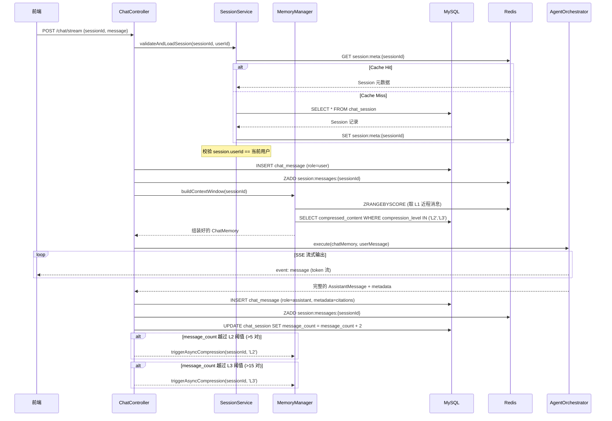
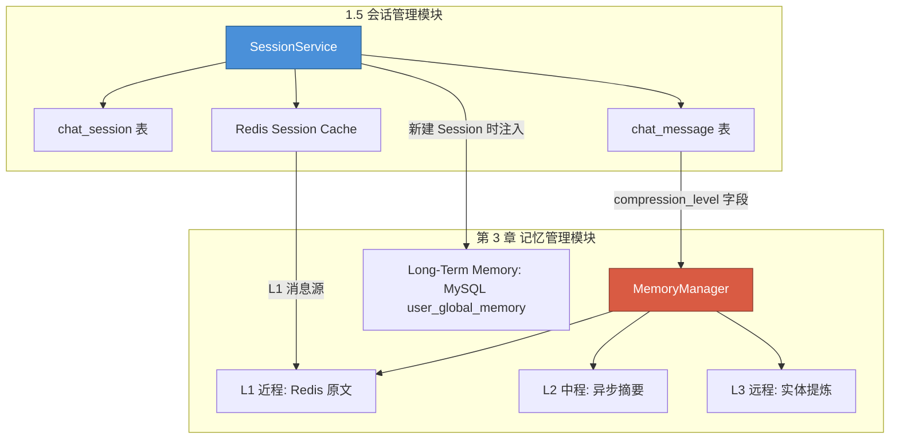

# 1.5 会话管理与对话持久化模块 [core]

> [!IMPORTANT]
> 本章建议插入在 **第 1 章 (Agent 编排)** 和 **第 3 章 (上下文与记忆管理)** 之间，编号为 **1.5**。
> 它是 Agent 对话流程的基础设施层——没有 Session，Agent 和 Memory 模块都无法正确工作。

---

## 设计目标

为系统提供完整的**多会话生命周期管理**能力，使用户能够：

1. **创建新会话 (New Session)**，每次开启全新上下文。
2. **切换会话 (Switch Session)**，在不同话题间自由跳转，上下文互不污染。
3. **浏览历史对话 (History)**，支持分页加载过往完整对话记录。
4. **会话归档与删除 (Archive/Delete)**，支持软删除与逻辑归档。

---

## 核心存储设计

严格遵循项目的**核心存储规范**：

| 存储层 | 职责 | 存什么 |
|---|---|---|
| **MySQL** | 会话元数据 + 消息记录持久化 | `chat_session` 表、`chat_message` 表 |
| **Redis** | 活跃会话缓存 + 近程消息快取 | 当前活跃 Session 的 L1 消息队列、Session 元数据热缓存 |
| **MinIO** | — | 本模块不涉及文件存储 |
| **ES** | — | 本模块不涉及检索 |

---

## 数据库 Schema 设计

### 表 1：`chat_session` — 会话元信息

```sql
CREATE TABLE chat_session (
    id              BIGINT          PRIMARY KEY AUTO_INCREMENT,
    session_id      VARCHAR(36)     NOT NULL UNIQUE COMMENT 'UUID v7，兼顾唯一性与时间排序',
    user_id         BIGINT          NOT NULL COMMENT '关联用户表',
    title           VARCHAR(200)    DEFAULT NULL COMMENT '会话标题，首轮对话后由 LLM 自动生成',
    status          VARCHAR(16)     NOT NULL DEFAULT 'ACTIVE' COMMENT 'ACTIVE / ARCHIVED / DELETED',
    model_id        VARCHAR(64)     DEFAULT NULL COMMENT '该会话绑定的模型标识（可选）',
    message_count   INT             NOT NULL DEFAULT 0 COMMENT '消息计数器，用于触发 L2/L3 压缩',
    summary         TEXT            DEFAULT NULL COMMENT '会话级摘要（L3 压缩后的最终产物）',
    pinned          TINYINT(1)      NOT NULL DEFAULT 0 COMMENT '是否置顶',
    created_at      DATETIME(3)     NOT NULL DEFAULT CURRENT_TIMESTAMP(3),
    updated_at      DATETIME(3)     NOT NULL DEFAULT CURRENT_TIMESTAMP(3) ON UPDATE CURRENT_TIMESTAMP(3),
    archived_at     DATETIME(3)     DEFAULT NULL,

    INDEX idx_user_status_updated (user_id, status, updated_at DESC),
    INDEX idx_user_pinned (user_id, pinned DESC, updated_at DESC)
) ENGINE=InnoDB DEFAULT CHARSET=utf8mb4 COLLATE=utf8mb4_unicode_ci;
```

> [!NOTE]
> `message_count` 是一个关键字段——它与第 3 章的 L1/L2/L3 分级压缩阈值直接联动。每次消息写入时递增，当越过阈值（如 5、15）时触发异步压缩任务。

### 表 2：`chat_message` — 对话消息持久记录

```sql
CREATE TABLE chat_message (
    id              BIGINT          PRIMARY KEY AUTO_INCREMENT,
    message_id      VARCHAR(36)     NOT NULL UNIQUE COMMENT 'UUID',
    session_id      VARCHAR(36)     NOT NULL COMMENT '关联 chat_session.session_id',
    role            VARCHAR(16)     NOT NULL COMMENT 'user / assistant / system / tool',
    content         TEXT            NOT NULL COMMENT '消息正文（Markdown / JSON）',
    content_type    VARCHAR(16)     NOT NULL DEFAULT 'text' COMMENT 'text / tool_call / tool_result / plan',
    token_count     INT             DEFAULT NULL COMMENT '该条消息估算 token 数，用于上下文窗口管理',

    -- 结构化元数据（JSON 列，而非打平为多列）
    metadata        JSON            DEFAULT NULL COMMENT '扩展字段：citations[], tool_name, plan_steps[] 等',

    -- 压缩状态标记
    compression_level VARCHAR(4)    DEFAULT 'L1' COMMENT 'L1(原文) / L2(摘要) / L3(实体)',
    compressed_content TEXT         DEFAULT NULL COMMENT '压缩后的摘要文本（L2/L3 级别时填充）',

    created_at      DATETIME(3)     NOT NULL DEFAULT CURRENT_TIMESTAMP(3),

    INDEX idx_session_created (session_id, created_at ASC),
    INDEX idx_session_compression (session_id, compression_level)
) ENGINE=InnoDB DEFAULT CHARSET=utf8mb4 COLLATE=utf8mb4_unicode_ci;
```

> [!TIP]
> **`metadata` 使用 JSON 列的设计理由**：不同 `content_type` 的消息携带的元数据结构差异巨大——`tool_call` 需要 `tool_name` 和 `arguments`，`assistant` 回复可能附带 `citations[]`。JSON 列比打平为十几个 nullable 列更优雅且面向未来。在 Java 层使用 Jackson 的多态反序列化（`@JsonTypeInfo`）映射为不同的 DTO 子类。

---

## Redis 缓存策略

```
┌──────────────────────────────────────────────────────────────┐
│                     Redis Key 设计                           │
├──────────────────────────────────────────────────────────────┤
│                                                              │
│  session:meta:{sessionId}     → Hash                         │
│    ┣ title                                                   │
│    ┣ userId                                                  │
│    ┣ status                                                  │
│    ┣ messageCount                                            │
│    ┗ updatedAt                                               │
│    TTL: 24h（活跃会话自动续期）                                │
│                                                              │
│  session:messages:{sessionId} → Sorted Set                   │
│    Score = 消息创建时间戳 (epoch ms)                           │
│    Value = 序列化的 ChatMessage JSON                          │
│    保留策略: 仅保留最近 N 条（L1 窗口，默认最近 10 条）          │
│    TTL: 2h（非活跃自动过期，下次访问从 MySQL 回填）             │
│                                                              │
│  user:active_session:{userId} → String                       │
│    Value = 当前活跃的 sessionId                                │
│    TTL: 24h                                                  │
│                                                              │
│  user:session_list:{userId}   → Sorted Set                   │
│    Score = updatedAt timestamp                                │
│    Value = sessionId                                         │
│    用途: 快速获取用户会话列表（避免高频 MySQL 查询）             │
│    TTL: 1h（短 TTL，降级到 MySQL 代价不大）                    │
│                                                              │
└──────────────────────────────────────────────────────────────┘
```

> [!WARNING]
> Redis 中的消息缓存**仅为加速读取**，不是数据源。所有消息必须先写入 MySQL，再异步同步到 Redis。宕机后以 MySQL 为准进行缓存重建。

---

## REST API 契约

基础路径：`/api/v1/sessions`

### 1. 创建新会话

```
POST /api/v1/sessions
```

**Request Body:**
```json
{
    "modelId": "gpt-4o"  // 可选，不传则使用系统默认
}
```

**Response (201 Created):**
```json
{
    "sessionId": "019536a2-7c3d-7f00-8000-1a2b3c4d5e6f",
    "title": null,
    "status": "ACTIVE",
    "createdAt": "2026-03-28T12:30:00.000+08:00"
}
```

**后端行为：**
1. 生成 UUID v7 作为 `sessionId`。
2. 插入 `chat_session` 表（`title` 为 null，等待首轮对话后自动填充）。
3. 从 MySQL `user_global_memory` 读取用户长期记忆，注入首条 System Message 写入 `chat_message`。
4. 将 `sessionId` 设为该用户的 `user:active_session:{userId}`。
5. 更新 Redis `user:session_list:{userId}`。

---

### 2. 获取会话列表

```
GET /api/v1/sessions?page=0&size=20&status=ACTIVE
```

**Response (200):**
```json
{
    "content": [
        {
            "sessionId": "019536a2-...",
            "title": "2025年财报分析讨论",
            "status": "ACTIVE",
            "messageCount": 12,
            "pinned": true,
            "updatedAt": "2026-03-28T12:30:00.000+08:00",
            "preview": "请帮我分析一下2025年Q3的营收..."  
        }
    ],
    "page": 0,
    "size": 20,
    "totalElements": 47,
    "totalPages": 3
}
```

**后端行为：**
1. 优先从 Redis `user:session_list:{userId}` 获取 sessionId 列表。
2. Cache Miss 时降级查询 MySQL，按 `pinned DESC, updated_at DESC` 排序。
3. `preview` 字段取该会话最后一条 `user` 消息的前 80 个字符（从 Redis 取或 MySQL subquery）。

---

### 3. 获取会话详情（含消息历史）

```
GET /api/v1/sessions/{sessionId}/messages?page=0&size=50&order=ASC
```

**Response (200):**
```json
{
    "session": {
        "sessionId": "019536a2-...",
        "title": "2025年财报分析讨论",
        "status": "ACTIVE"
    },
    "messages": {
        "content": [
            {
                "messageId": "msg-001",
                "role": "user",
                "content": "请帮我分析2025年Q3财报",
                "contentType": "text",
                "createdAt": "2026-03-28T12:30:01.000+08:00",
                "metadata": null
            },
            {
                "messageId": "msg-002",
                "role": "assistant",
                "content": "根据检索到的文档，2025年Q3...",
                "contentType": "text",
                "createdAt": "2026-03-28T12:30:05.000+08:00",
                "metadata": {
                    "citations": [
                        { "docId": "doc-123", "chunkId": "chunk-456", "title": "2025Q3财报.pdf", "page": 12 }
                    ]
                }
            }
        ],
        "page": 0,
        "size": 50,
        "totalElements": 12
    }
}
```

**后端行为：**
1. 首页（page=0, ASC）加载流程：
   - 优先从 Redis `session:messages:{sessionId}` 获取缓存。
   - Cache Miss → 查 MySQL `chat_message` 表，按 `created_at ASC` 分页。
2. 如果发现该 Session 属于其他用户 → 返回 **403 Forbidden**（权限校验）。

---

### 4. 切换活跃会话

```
PUT /api/v1/sessions/{sessionId}/activate
```

**Response (200):**
```json
{
    "sessionId": "019536a2-...",
    "title": "2025年财报分析讨论",
    "status": "ACTIVE"
}
```

**后端行为（关键！与第 3 章记忆模块联动）：**
1. 将旧的活跃会话的 L1 消息从 Redis 持久化到 MySQL（如果尚未同步）。
2. 更新 `user:active_session:{userId}` 为新 sessionId。
3. 从 MySQL 加载新 Session 的最近 N 条消息到 Redis（预热 L1 缓存）。
4. 从 MySQL `user_global_memory` 重新加载用户长期记忆（跨会话共享）。
5. 重建 LangChain4j 的 `ChatMemory` 实例，填充当前 Session 的 L1 原文 + L2 摘要。

> [!IMPORTANT]
> 这一步是 Session 切换的核心复杂度所在。切换不仅仅是换个 ID——**整条 Agent 的上下文链路必须热替换**。实现上建议封装为 `SessionContextSwitcher` 服务类，统一编排以上 5 步，避免逻辑散落在 Controller 中。

---

### 5. 更新会话（重命名/置顶）

```
PATCH /api/v1/sessions/{sessionId}
```

**Request Body:**
```json
{
    "title": "新的标题",     // 可选
    "pinned": true           // 可选
}
```

**Response (200):** 返回更新后的 Session 对象。

---

### 6. 删除/归档会话

```
DELETE /api/v1/sessions/{sessionId}?mode=archive
```

| mode 参数 | 行为 |
|---|---|
| `archive` (默认) | 软删除：`status` 设为 `ARCHIVED`，消息保留 |
| `permanent` | 硬删除：彻底删除 `chat_session` 和关联的 `chat_message` 记录 |

**后端行为：**
1. 清除 Redis 中该 Session 的所有缓存键。
2. 如果删除的是当前活跃会话，自动将 `user:active_session` 切换到最近的其他 ACTIVE 会话（如果有）。
3. 归档模式下，可选触发一次 L3 终极压缩，将整个会话浓缩为一段 `summary` 存入 `chat_session.summary`。

---

## 与既有 SSE 接口的集成

现有的 `/api/v1/agent/chat/stream` 接口需要增加 `sessionId` 参数：

```
POST /api/v1/agent/chat/stream
Content-Type: application/json

{
    "sessionId": "019536a2-...",   // 必填（新增）
    "message": "请帮我分析2025年Q3财报"
}
```

### 消息持久化时序（嵌入 Chat 流程）



---

## 会话自动标题生成

### 触发时机
- 当 Session 的 `title` 为 `null` **且** `message_count` 达到 **2**（即完成首轮用户提问 + 助手回复）时触发。

### 实现方式
```yaml
# application.yml
session:
  auto-title:
    enabled: true
    max-input-chars: 500   # 截取首轮对话前 500 字符送入 LLM
    model: "lightweight"    # 使用轻量级模型生成标题，节约成本
```

**异步执行流程：**
1. 首轮对话完成后，`@Async` 投递标题生成任务。
2. 将用户首条消息 + 助手首条回复（截断至 `max-input-chars`）发送给轻量 LLM。
3. Prompt 模板（统一管理在 `prompts/` 目录下）：
   ```
   请根据以下对话内容，生成一个简洁的中文标题（不超过 20 个字，不要引号）：
   用户：{userMessage}
   助手：{assistantMessage}
   ```
4. 将结果 UPDATE 到 `chat_session.title`，同步更新 Redis 缓存。
5. 通过 SSE 推送一个 **`event: session_update`** 事件通知前端刷新侧边栏标题：
   ```json
   event: session_update
   data: {"sessionId": "019536a2-...", "title": "2025年Q3财报分析"}
   ```

---

## 与第 3 章记忆模块的集成点



**关键集成约定：**

| 动作 | 1.5 模块职责 | 第 3 章模块职责 |
|---|---|---|
| 新建 Session | 创建 DB 记录，写入首条 System Message | 从 `user_global_memory` 加载长期记忆，生成 System Prompt 内容 |
| 每轮对话 | 持久化 user/assistant 消息，递增 `message_count` | 判断是否触发 L2/L3 压缩，更新 `compression_level` 和 `compressed_content` |
| 切换 Session | 持久化旧 Session 缓存，预热新 Session L1 | 重建 `ChatMemory` 实例，装载 L1 原文 + L2/L3 摘要 |
| 归档 Session | 更新 `status`，清理 Redis | 可选触发终极 L3 压缩生成 `summary` |

---

## Java 层核心类设计概览

```
com.example.agenticrag
├── session
│   ├── controller
│   │   └── SessionController.java          // REST API, 不含业务逻辑
│   ├── service
│   │   ├── SessionService.java             // 会话 CRUD 核心逻辑
│   │   ├── SessionContextSwitcher.java     // 会话切换编排器（持久化旧上下文 + 预热新上下文）
│   │   └── SessionTitleGenerator.java      // 异步标题生成（@Async）
│   ├── repository
│   │   ├── ChatSessionMapper.java          // MyBatis Mapper
│   │   └── ChatMessageMapper.java          // MyBatis Mapper
│   ├── cache
│   │   └── SessionRedisManager.java        // 封装所有 Redis 操作（读写 Session 缓存）
│   ├── model
│   │   ├── entity
│   │   │   ├── ChatSession.java
│   │   │   └── ChatMessage.java
│   │   ├── dto
│   │   │   ├── SessionCreateRequest.java
│   │   │   ├── SessionUpdateRequest.java
│   │   │   ├── SessionListResponse.java
│   │   │   └── MessagePageResponse.java
│   │   └── enums
│   │       ├── SessionStatus.java          // ACTIVE, ARCHIVED, DELETED
│   │       ├── MessageRole.java            // USER, ASSISTANT, SYSTEM, TOOL
│   │       └── CompressionLevel.java       // L1, L2, L3
│   └── event
│       └── SessionEventPublisher.java      // Spring Event: 发布 SESSION_CREATED / SWITCHED 等事件
```

> [!TIP]
> **为什么引入 Spring Event？** 会话的创建、切换、归档会触发记忆模块、缓存模块等多个下游动作。使用 `ApplicationEventPublisher` 发布领域事件（如 `SessionCreatedEvent`），各模块通过 `@EventListener` 解耦订阅，避免 `SessionService` 直接依赖 `MemoryManager`（违反单一职责原则）。

---

## 给 AI 编程助手的补充指令

6. **Session 隔离性是铁律**：任何涉及消息读写的操作，在 Service 层必须校验 `session.userId == currentUserId`。这不是可选的——它是安全模型的一部分，与第 5 章权限模块同级。
7. **消息持久化的事务边界**：用户消息写入 MySQL 和 Redis **必须在 Agent 执行前完成**（防止浏览器关闭后丢消息）。助手回复则在 SSE 流结束后持久化。两者不在同一个事务中。
8. **会话切换不可阻塞**：`SessionContextSwitcher` 中的旧会话持久化和 L2/L3 压缩必须异步执行（`@Async` 或线程池），切换操作本身应在 200ms 内返回响应。
9. **Redis 只是加速层**：所有 Redis 操作必须有 MySQL 降级路径。`SessionRedisManager` 的每个读方法都必须接受一个 `Supplier<T> fallback` 参数。
